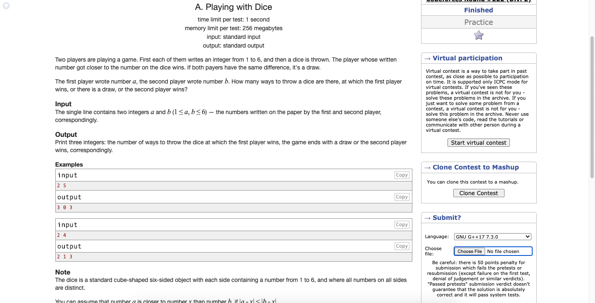

# Codeforces-378A-Playing-with-Dice
### Problem

### Program Simulation
<h1> Note the "absolute" value is used in the conditions below. </h1>
<pre>
  Sample Input: 2 5
  
  a = 2
  b = 5
  
  f = 0
  d = 0
  s = 0
  
  * First Loop *
    if(2 - 1 < 5 - 1) // true
      f -> 1
  
  * Second Loop *
    if(2 - 2 < 5 - 2) // true
      f -> 2
  
  * Third Loop *
    if(2 - 3 < 5 - 3) // true
      f -> 3
  
  * Fourth Loop *
    if(2 - 4 < 5 - 4) // false
    else if(5 - 4 < 2 - 4) // true
      s -> 1
      
  * Fifth Loop *
    if(2 - 5 < 5 - 5) // false
    else if(5 - 5 < 2 - 5) // true
      s -> 2
  
  * Sixth Loop *
    if(2 - 6 < 5 - 6) // false
    else if(5 - 6 < 2 - 6) // true
      s -> 3
  
  print f, d, s
  
  Final Output:
  3 0 3
  

  Sample Input: 2 4
  
  * First Loop *
    if(2 - 1 < 4 - 1) // true
      f -> 1
  
  * Second Loop *
    if(2 - 2 < 4 - 2) // true
      f -> 2
  
  * Third Loop *
    if(2 - 3 < 4 - 3) // false
    else if(4 - 3 < 2 - 3) // false
    else
      d -> 1
  
  * Fourth Loop *
    if(2 - 4 < 4 - 4) // false
    else if(4 - 4 < 2 - 4) // true
      s -> 1
  
  * Fifth Loop *
    if(2 - 5 < 4 - 5) // false
    else if(4 - 5 < 2 - 5) // true
      s -> 2
  
  * Sixth Loop *
    if(2 - 6 < 4 - 6) // false
    else if(4 - 6 < 2 - 6) // true
      s -> 3
  
  print f, d, s
  
  Final Output:
  2 1 3
</pre>
